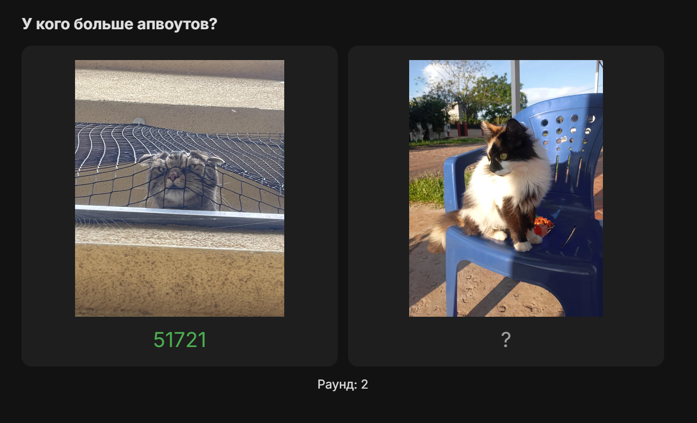

# Cat Upvote



Или же "У кого апвоутов больше?". Это простая игра, в которой ты должен угадать, у какого из двух представленных котиков больше апвоутов на Reddit.

## Требования

-   Node.js v24+
-   PostgreSQL v17+

## Установка и запуск

1. В `.env` файле укажите данные для подключения к вашей базе данных PostgreSQL. Файл-пример `.env.example`.
2. Установите зависимости:
    ```bash
    npm install
    ```
3. Выполните миграции базы данных:
    ```bash
    npm run migrate
    ```
    > Для заполнения базы данных начальными данными используйте [reddit-post-parser](https://github.com/nekotyan2d/reddit-post-parser)
4. Запустите dev сервер:
    ```bash
    npm run dev
    ```

## Лицензия

[MIT](LICENSE)
